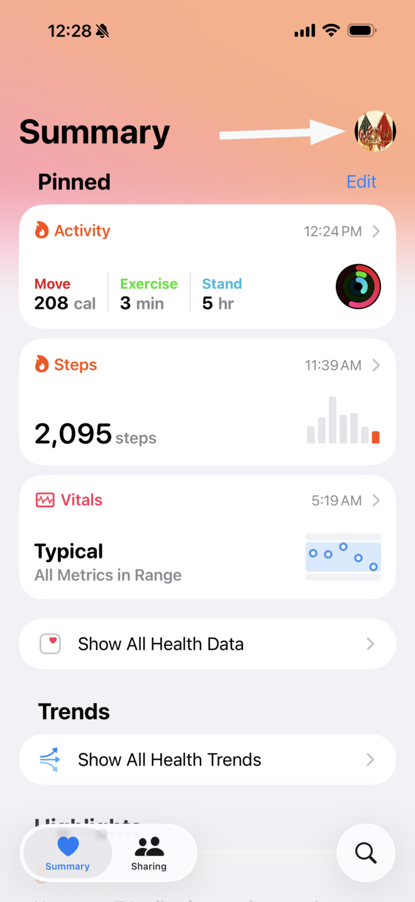
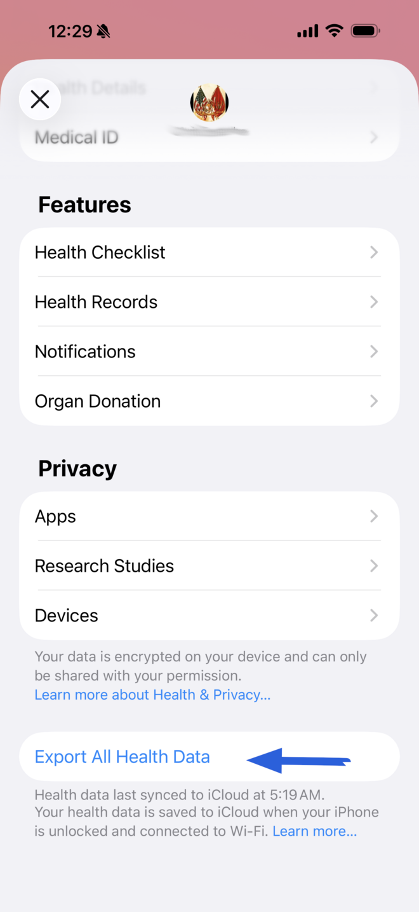
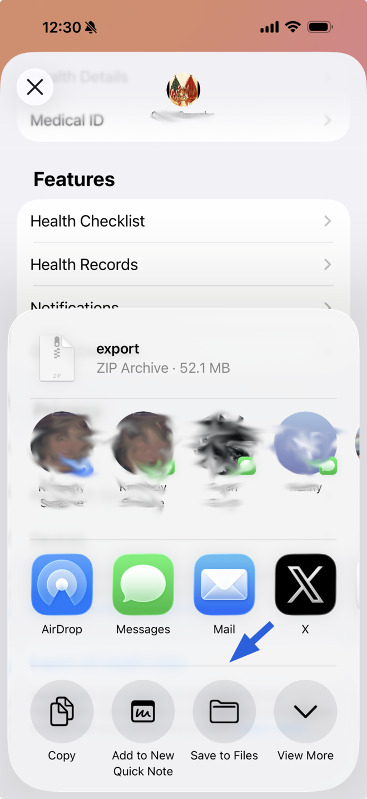
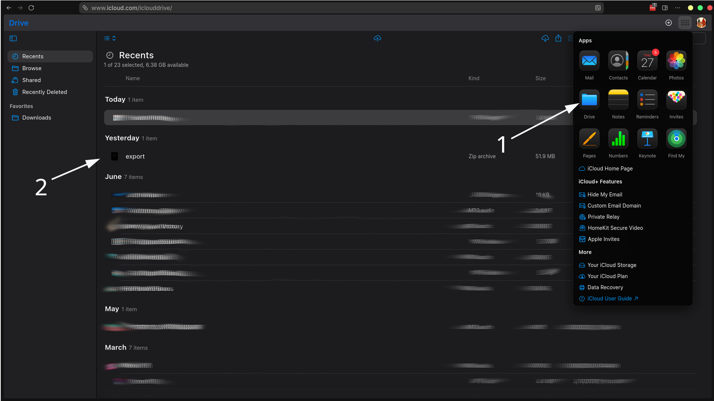
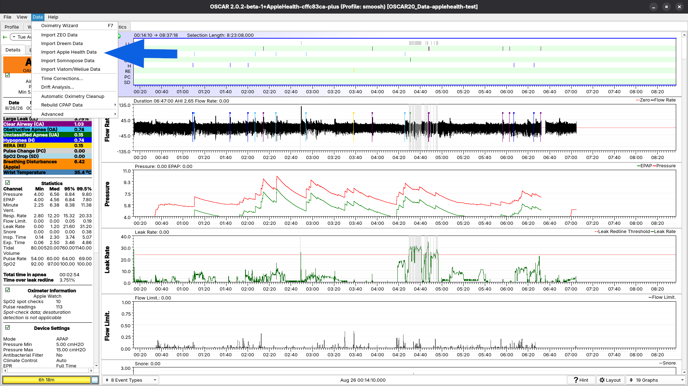
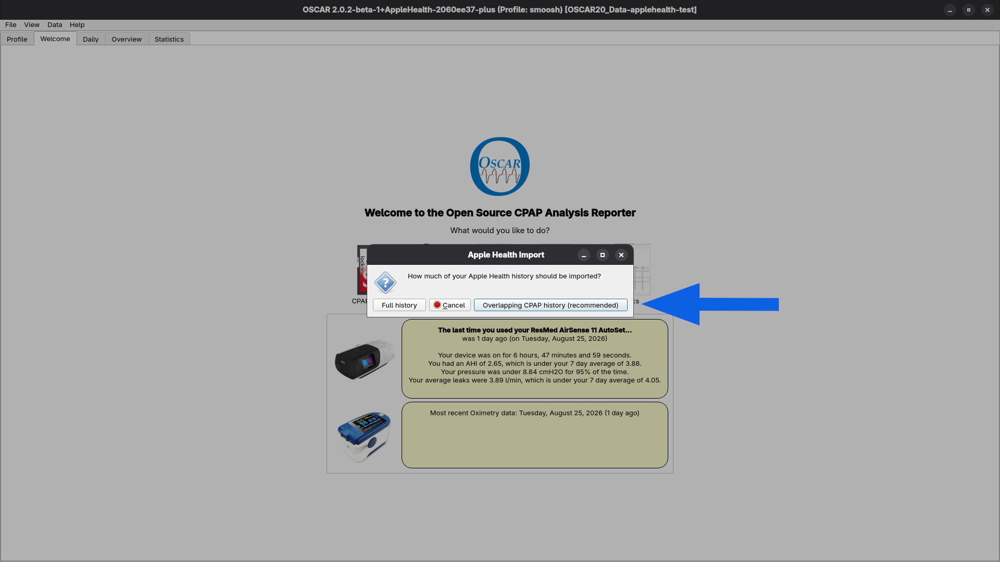
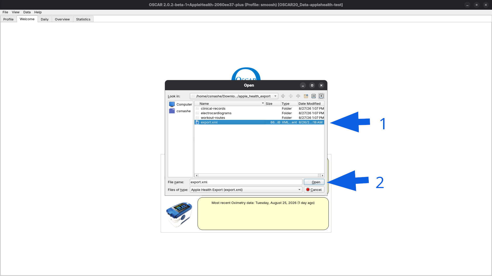
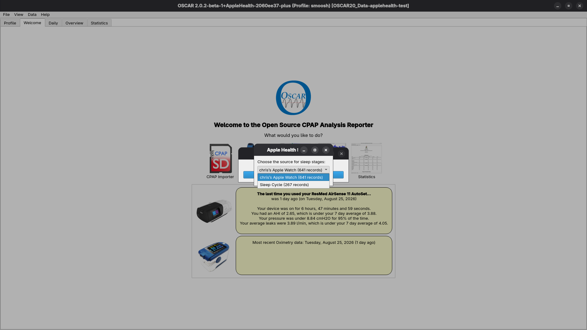

# Getting Started with OSCAR 2.0

OSCAR 2.0 replaces all previous versions of OSCAR. If you are an existing OSCAR 1.x user, this guide will help you migrate your data and get up to speed with what's new.

## What's Different

OSCAR 2.0 stores all data in an SQLite database rather than in individual files. This makes the data more powerful and accessible, but it means the OSCAR 2.0 database is not compatible with OSCAR 1.x. OSCAR 2.0 uses a separate data folder (`OSCAR20_Data`) from OSCAR 1.x (`OSCAR_Data`), so both versions can coexist on your computer.

We recommend leaving OSCAR 1.x installed until you are satisfied that OSCAR 2.0 is working well for you.

## How to Migrate Your Data

When you start OSCAR 2.0 for the first time, it will offer to convert your existing `OSCAR_Data` folder into the new `OSCAR20_Data` format. This is the easiest way to get started — all your OSCAR 1.x data will be preserved and converted.

If you prefer to migrate selectively, you can import individual OSCAR 1.x profiles at any time using *File / Profiles / Import from OSCAR...*.

After migration, the overall structure you are familiar with is preserved: there is still a Profiles directory with a subdirectory for each profile, machine subdirectories within each profile, and SD card backups in the Backup directory.

## What to Expect

Once your data is migrated, day-to-day use of OSCAR 2.0 will be familiar: you can read data from CPAP SD cards, add it to a profile, and examine graphs and reports as before. The interface is largely unchanged from OSCAR 1.x.

## What's New

OSCAR 2.0 adds three major features for users who want to examine their data more closely:

1. **CSV Export has been replaced** with a more flexible and powerful export tool (*File / Export Data / CSV Export Wizard...*). You can extract any numeric information visible in OSCAR, or the underlying data needed to recalculate those numbers.

2. **Profile import/export** (*File / Profiles*) lets you package a single profile — or a selected date range — into a `.oscar` file that can be imported into any OSCAR 2.0 installation. This makes it easy to share data with another user so they can examine it with OSCAR's full capabilities, or to create a backup of a profile that includes the CPAP SD card data.

3. **Direct SQL access**: because the database is SQLite, any SQL-capable program can read OSCAR's data directly, including the waveform data used for graphs.

4. **Apple Health (Apple Watch) import** (*Data / Import Apple Health Data*) reads the export file produced by an iPhone. OSCAR imports the watch's sleep stages, heart rate, SpO2, respiratory rate, heart rate variability, nightly breathing-disturbance score, and wrist temperature, shown on the same Daily-view timeline as your CPAP data — so sleep the watch recorded while your mask was off is visible alongside your therapy data. The import creates two devices, "Apple Watch Sleep" (stages) and "Apple Watch" (vitals); re-importing a newer export only adds nights not already present. Vitals are trimmed to each night's sleep window, since the watch also records heart rate all day. See the walkthrough below.

## Importing Apple Health Data

**Step 1 — Export from the iPhone.** In the Health app, tap your profile picture in the top-right corner of the Summary screen:

Scroll to the bottom of the profile page and tap *Export All Health Data*. The export takes a few minutes to prepare:

**Step 2 — Get the file to your computer.** When the export finishes, a share sheet opens with the `export.zip` archive. Send it to your computer however you prefer — AirDrop, or *Save to Files* into iCloud Drive:

If you used iCloud Drive, download it on your computer from [icloud.com](https://www.icloud.com) → Drive (1), where the export appears in Recents (2):

Unzip the archive; the file OSCAR needs is `apple_health_export/export.xml`.

**Step 3 — Import into OSCAR.** Choose *Data / Import Apple Health Data*:

If your profile already has CPAP data, OSCAR asks how much history to bring in — importing only the period overlapping your CPAP history is recommended, and you can re-run the import later for more:

Select the `export.xml` you unzipped:

If your Health data contains sleep records from phone apps as well as the watch, OSCAR asks which source to use for sleep stages — the Apple Watch is preselected:

The import then runs; a progress bar tracks the file parse, and a summary reports how many sleep and vitals sessions were added.

## If You Need to Go Back

If you ever need to load OSCAR 2.0 data back into OSCAR 1.x, use *Data / Rebuild CPAP Data / \<machine\>* in OSCAR 1.x and point it to the Backup directory inside your OSCAR 2.0 profile.

## Feedback

We are eager to hear your experience with OSCAR 2.0!

-- The OSCAR Team
